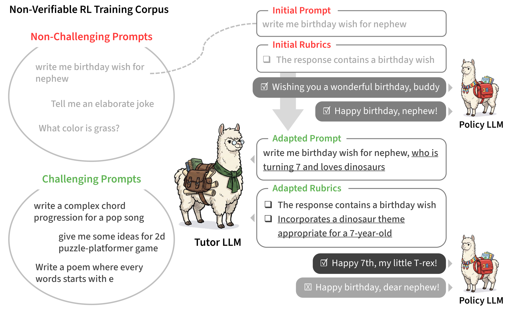

# 🎓 LLM-as-a-Tutor: Policy-Aware Prompt Adaptation for Non-Verifiable RL

<a href="https://arxiv.org/abs/2607.04412"></a>
<a href="#-bibtex"></a>

Official Implementation of LLM-as-a-Tutor. The tutor LLM detects prompts whose
rollouts have collapsed in quality and appends an atomic constraint, raising
prompt difficulty in step with the policy and producing a self-calibrating
training signal for non-verifiable instruction-following RL.

<p align="center">
  
</p>

## 🛠️ Setup

```sh
# uv (https://docs.astral.sh/uv/getting-started/installation/)
uv sync
uv pip install "flash-attn>=2.8.3" --no-build-isolation
```

Environment variables: `OPENAI_API_KEY`, `HF_TOKEN`. Optional: `WANDB_API_KEY`,
`VERL_LOG_LEVEL` (default `WARNING`).

## 📦 Dataset

The retained configs point at the published HF dataset
`BBang3/wildchecklists-with-general` (4K WildChat prompts already pre-seeded
with general rubrics — no preprocessing needed). To swap in a different HF
dataset or a local JSON/JSONL file, convert it to parquet first with
`preprocess.py`, then point `data.train_files` at the resulting path:

```sh
uv run python preprocess.py \
    --dataset_path <hf-dataset-id-or-local-json> \
    --dataset_name <out-name> \
    --prompt_column_name prompt
```

## 🚀 Training

All paper runs share the same two-stage launcher: pre-fill the general rubric
on the training parquet, then start GRPO. Pass any config under `configs/`:

```sh
CUDA_VISIBLE_DEVICES=0,1,2,3 ./run_with_offline_rubric.sh \
    --config-name llm_tutor
```

The launcher forwards extra args as Hydra overrides to both stages, e.g.
`data_generator.offline_overwrite_existing=true`.

Run any paper experiment by passing the matching config name:

```sh
CUDA_VISIBLE_DEVICES=0,1,2,3 ./run_with_offline_rubric.sh \
    --config-name <config-name>
```

#### Main result

| Method | Config | Notes |
|---|---|---|
| **LLM-as-a-Tutor** (Ours) | `llm_tutor` | |
| Base rubrics | `llm_tutor_base_rubrics` | Static general rubric, no online data gen |
| WildChecklists | `llm_tutor_wildchecklists` | Static rubric from WildChecklists dataset |
| Policy-adaptive rubrics | `llm_tutor_policy_adaptive_rubrics` | Adapts rubric, not prompt |
| Evol-Instruct | `evol_instruct_baseline` | See "Evol-Instruct" below |
| EVA | `llm_tutor_eva` | Requires ArmoRM scalar RM (auto-loaded) |
| Distillation | — | See "SFT distillation" below |

#### Adaptiveness ablation

All variants use the same append-based modification but differ in the trigger.

| Variant | Config | Notes |
|---|---|---|
| **Adaptive** (Ours) | `llm_tutor` | Examiner uses the policy's rollouts |
| Always | `llm_tutor_always` | Append constraint to every prompt |
| Random | `llm_tutor_random` | Append to a random 28% per epoch |
| Wrong | `llm_tutor_wrong` | Examiner reads 8B generator's rollouts, not policy's |
| Metric | `llm_tutor_metric` | Metric gate (rollout-score std) replaces the LLM examiner |

#### Modification strategy ablation

All variants use the same adaptive trigger but differ in how the prompt is modified.

| Variant | Config | Notes |
|---|---|---|
| **Append** (Ours) | `llm_tutor` | Accumulate atomic constraints across epochs |
| Reset | `llm_tutor_reset` | Replace prior constraint each epoch |
| Rewrite | `llm_tutor_rewrite` | Rewrite the whole prompt instead of appending |

### 🧪 Special baselines

**Evol-Instruct.** Offline-evolve prompts once with `baselines/evol_instruct/`,
then train against the resulting dataset (`evol_instruct_baseline.yaml` already
points at the published HF copy `BBang3/wildchecklists-evol-instruct`). To
regenerate locally see `baselines/evol_instruct/README.md`.

**SFT distillation.** Generate teacher responses with the 8B tutor, then SFT
the 1.7B policy on them. End-to-end recipe in
`baselines/sft_distill/README.md`.

## 📊 Analysis

Scripts under `analysis/scripts/` consume `epoch_state` and rollout JSONLs
written during training to reproduce the paper's analysis figures. See
`analysis/README.md` for the per-figure pipeline.

## 🗂️ Layout

```
configs/                       Hydra configs (one per paper row)
data_generation/
  prompts/                     Tutor + judge prompt templates (Appendix E)
  offline_general_rubric.py    Stage 1 of the launcher
verl/llm_tutor/                OnlineDataGenerator, AdaptiveDataset, reward fns
verl/verl/trainer/main_ppo.py  GRPO entry point
baselines/
  evol_instruct/               Offline prompt-evolution baseline
  sft_distill/                 SFT distillation baseline
analysis/scripts/              Analysis figure reproduction
preprocess.py                  HF/JSON → parquet conversion utility
run_with_offline_rubric.sh     Two-stage training launcher
```

## 📖 BibTeX

If you find this work useful, please consider citing:

```bibtex
@misc{kim2026llmtutor,
      title={LLM-as-a-Tutor: Policy-Aware Prompt Adaptation for Non-Verifiable RL}, 
      author={Yujin Kim and Namgyu Ho and Sangmin Hwang and Joonkee Kim and Yongjin Yang and Sangmin Bae and Seungone Kim and Jaehun Jung and Se-Young Yun and Hwanjun Song},
      year={2026},
      eprint={2607.04412},
      archivePrefix={arXiv},
      primaryClass={cs.AI},
      url={https://arxiv.org/abs/2607.04412}, 
}
```
